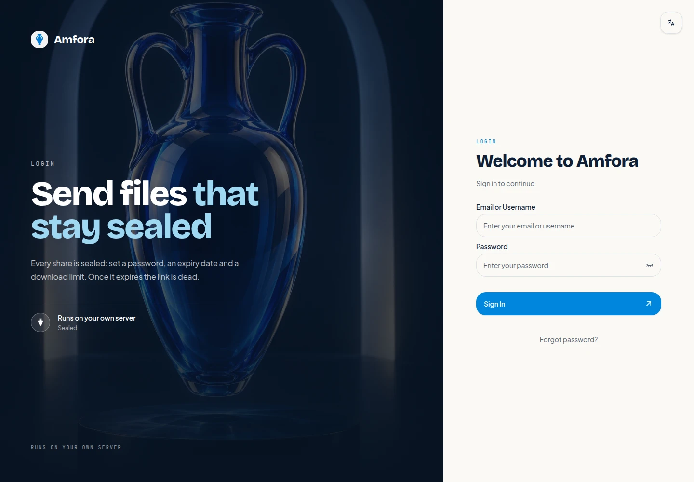

# Amfora

Amfora is a self-hosted workspace for sending and receiving files. Upload files
to storage you control, turn them into a guarded share, or give someone a
browser link where they can send files back without creating an account.

<p align="center">
  
</p>

[Product website](https://amfora.solutionmax.net) ·
[Documentation](https://amfora.solutionmax.net/docs/)

Amfora is a maintained fork of [Palmr](https://github.com/kyantech/Palmr).
See [NOTICE](NOTICE) for attribution and bundled MinIO licensing information.

## The workflow

### 1. Keep files in one workspace

Open **My Files** to upload files, create folders, and see what is stored. The
workspace tracks uploads and makes the same files available when you create a
share.

### 2. Send a controlled link

Select files and choose **Create share**. Give the share a name, then choose
the restrictions that fit the handoff:

- password protection;
- expiration date;
- maximum views; and
- recipient email notifications.

Amfora creates an `/s/<alias>` link. Recipients open it in a browser and do not
need an Amfora account. The owner can later edit the share, its files, and its
restrictions.

### 3. Receive files from outside

Open **Receive files**, set optional file count, size, type, password, and
expiration limits, then copy the `/r/<alias>` link. A sender uploads through
the public page and can be asked for a name or email address. The owner reviews
those uploads in **Reverse shares**, downloads them, or copies them into the
workspace.

## Product tour

The screenshots show the English interface with demonstration data.


The dashboard brings uploads, shares, receive links, storage usage, and recent
files into one starting point.


A share presents its files and delivery rules in a focused download view.


A receive link gives outside collaborators a simple upload form with the limits
set by its owner.



The sign-in screen supports password authentication, password recovery, and
two-factor authentication when it is enabled for the account.

## Workspace features

- folders, file management, downloads, and shares;
- public send and receive links with password, expiry, view, size, and type
  controls, plus recipient email notifications;
- QR code export for shares;
- user invitations, roles, deactivation, profile settings, trusted devices,
  and TOTP two-factor authentication with backup codes;
- application branding controls for the name, logo, accent colour, font,
  corner radius, and default language; and
- optional OAuth2/OIDC sign-in providers configured by an administrator.

## Run the private source branch

The repository is currently private. You need GitHub access, Git, and Docker
with Compose and BuildKit; public release downloads are not yet available.

```bash
git clone --branch amfora https://github.com/raym0nz82/amfora.git
cd amfora
docker compose up -d --build
```

Open <http://localhost:5487>. On a new database, the first account created
through the first-run screen becomes the administrator. Later accounts are
ordinary users unless an administrator invites or promotes them.

The sample Compose file publishes the web interface on `5487` and bundled
storage on `9379`. The browser must be able to reach `STORAGE_URL`; the local
example uses `http://127.0.0.1:9379`. The API listens on `3333` inside the
container and is not published by the sample Compose file.

To build the image separately:

```bash
docker buildx build --load -t amfora:local .
docker compose up -d
```

## Storage and deployment

The image includes a private MinIO-backed storage service. You can use an
external S3-compatible provider instead:

```yaml
environment:
  ENABLE_S3: "true"
  STORAGE_URL: "https://files.example.com"
  S3_ENDPOINT: "s3.example.com"
  S3_ACCESS_KEY: "your-access-key"
  S3_SECRET_KEY: "your-secret-key"
  S3_BUCKET_NAME: "amfora-files"
  S3_USE_SSL: "true"
```

`STORAGE_URL` is the browser-facing URL used for generated upload and download
requests. Put both the app and that storage endpoint behind HTTPS, keep the API
on the private container network, and set `SECURE_SITE=true` for secure cookies.
Configure HSTS at the HTTPS reverse proxy.

The seeded workspace defaults to a 1 GiB maximum file size and 10 GiB maximum
storage per user; an administrator can change those limits in Settings. See
[`docker-compose.yaml`](docker-compose.yaml) and
[`apps/server/.env.example`](apps/server/.env.example) for the complete
configuration, including S3, proxy, CORS, and rate-limit settings.

Amfora does not promise application-level encryption at rest or end-to-end
encryption. Protect the host or S3 account with the controls appropriate to the
deployment. Passwords are stored as bcrypt hashes, and share passwords are sent
in a request header rather than in a URL.

## Administration

Administrators can invite and manage users, assign roles, configure storage and
limits, customize the application, configure email, and enable authentication
providers. The seeded provider choices are Google, Discord, GitHub, Auth0,
Kinde, Zitadel, Authentik, Frontegg, and Pocket ID; additional compatible OIDC
providers can be configured.

Each user can enable TOTP two-factor authentication, download backup codes, and
remove trusted devices. Password reset requires password authentication and a
working SMTP configuration. Invite links are one-time registration links.

## Backups and upgrades

For bundled storage, back up the persistent `/app/server` directory, including
`prisma/amfora.db`, `minio-data`, and the generated storage credentials. For
external S3, back up the SQLite database and the S3 bucket according to the
provider’s procedure. Keep the persistent volume when replacing the image;
startup applies schema changes and seeds missing configuration/provider data.

Installations created under Palmr are migrated from `prisma/palmr.db` to
`prisma/amfora.db`, while an existing internal bucket is preserved when no
explicit bucket override is supplied. Verify a test share and download after
an upgrade.

To recover a password from a trusted operator shell:

```bash
docker compose exec amfora sh -lc 'cd /app/amfora-app && ./reset-password.sh'
```

Use `--list` to list users. This tool bypasses normal account flows.

## Development

```bash
cd apps/web && pnpm install && pnpm dev       # http://localhost:3000
cd apps/server && pnpm install && pnpm dev   # http://localhost:3333
```

Run server tests with `cd apps/server && pnpm test`. Before opening a change,
the web checks `pnpm format:check` and `pnpm type-check` are useful alongside
the repository’s normal build and lint commands.

## Licence and attribution

Amfora is licensed under the Apache License 2.0; see [LICENSE](LICENSE). The
bundled `minio` and `mc` programs are separate, unmodified AGPL-3.0 programs
redistributed with the image. See [NOTICE](NOTICE) and
[`LICENSES/AGPL-3.0.txt`](LICENSES/AGPL-3.0.txt) for attribution and source
information.
