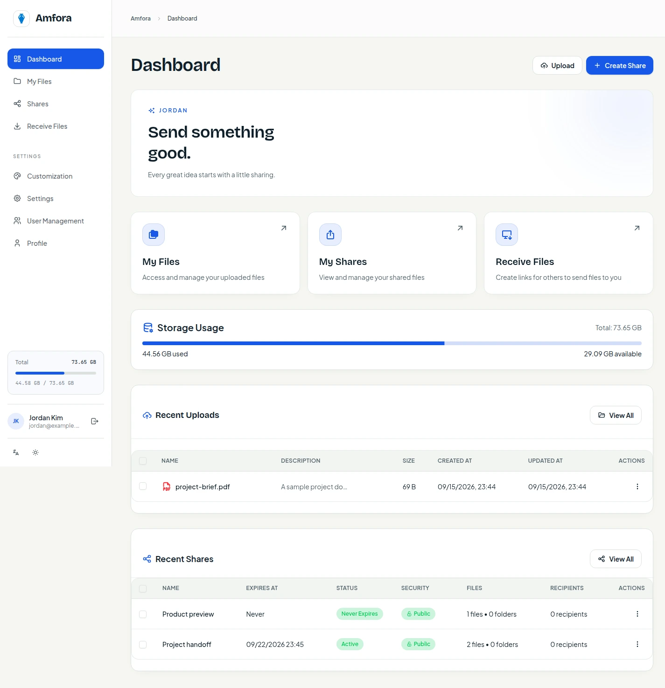
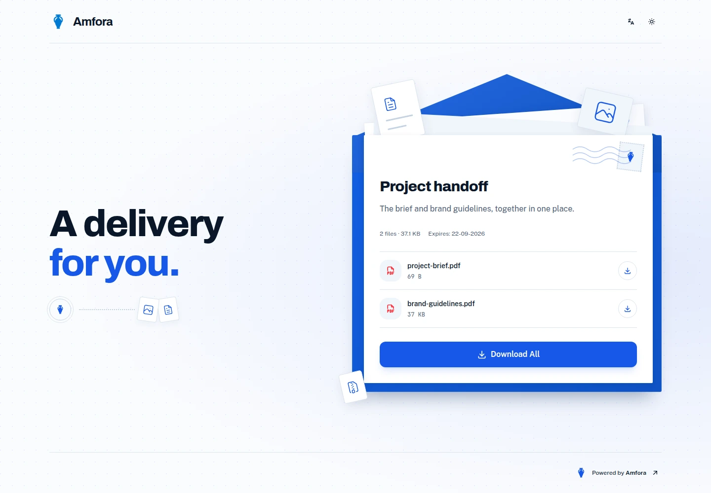
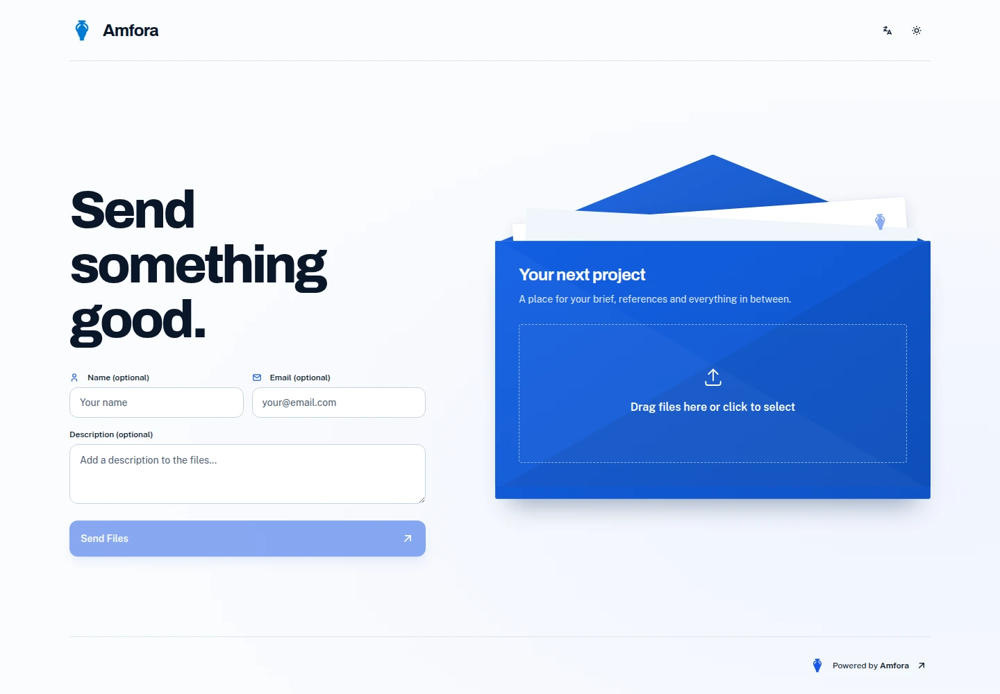

# Amfora

<p align="center">
  
</p>

Amfora is a self-hosted workspace for sending and receiving files. Run it on
your own server, keep the storage under your control, and give recipients a
browser link instead of another account to manage.

Amfora is a maintained fork of [Palmr](https://github.com/kyantech/Palmr).
See [NOTICE](NOTICE) for attribution and bundled MinIO licensing information.

[Website](https://amfora.solutionmax.net) · [Documentation](https://amfora.solutionmax.net/docs/)

## What Amfora does

- **Send files.** Upload files, group them in a share, and create one link.
  Protect a share with a password, an expiration date, a view limit, or named
  recipients.
- **Receive files.** Create a receive link with optional file count, size,
  type, password, and expiration limits. People can upload through the link
  without an Amfora account.
- **Keep files in your storage.** The image includes a private MinIO-backed
  storage service, or you can connect an external S3-compatible provider.
- **Make it yours.** Administrators can set the application name, logo, accent
  colour, font, corner radius, and default language from the workspace.
- **Operate an actual workspace.** Manage folders, files, shares, users,
  invitations, two-factor authentication, trusted devices, and optional OAuth2
  or OIDC providers.





## Quick start with Docker

The repository is currently **private**. Invited collaborators need GitHub access,
Git, and Docker with Compose and BuildKit. Public release downloads are not yet available.

```bash
git clone --branch amfora https://github.com/raym0nz82/amfora.git
cd amfora
docker compose up -d --build
```

Open <http://localhost:5487>. On first start the container creates the SQLite
database, seeds the application configuration, and makes the first account an
administrator. Create that account through the first-run screen. Subsequent
accounts are ordinary users unless an administrator creates or promotes them.

The sample Compose file publishes the web interface on `5487` and bundled
storage on `9379`. `STORAGE_URL` must be the storage address that a **browser**
can reach, including its protocol. For the local example it is
`http://127.0.0.1:9379`; for a deployed instance it should be the public storage
URL instead.

The API listens on `3333` inside the container. The bundled web application
calls it through the server-side proxy, so the sample Compose file leaves the
API port unpublished.

## Building from the private source branch

The maintained source branch is `amfora`:

```bash
git clone --branch amfora https://github.com/raym0nz82/amfora.git
cd amfora
docker buildx build --load -t amfora:local .
docker compose up -d
```

Use repository credentials with the clone command when access to the private
source repository is required. `buildx` is required because the Dockerfile
uses heredoc `COPY` syntax. The image pins the official MinIO and `mc` binaries
by digest; they are redistributed unmodified as described in [NOTICE](NOTICE).

For frontend and API development, install dependencies in each app and run
the two development servers:

```bash
cd apps/web && pnpm install && pnpm dev       # http://localhost:3000
cd apps/server && pnpm install && pnpm dev   # http://localhost:3333
```

Run server checks with `cd apps/server && pnpm test`. The web build and lint
enforce formatting; `pnpm format:check` and `pnpm type-check` are useful before
opening a change.

## Production layout

Put both the app and the browser-facing storage endpoint behind HTTPS. A
typical split-domain arrangement is:

```text
https://app.example.com   -> Amfora web interface (container port 5487)
https://files.example.com -> bundled storage (container port 9379)
```

Set the relevant Compose environment values:

```yaml
environment:
  SECURE_SITE: "true"
  STORAGE_URL: "https://files.example.com"
```

Forward the storage hostname to port `9379` and configure the proxy/storage
service for the browser’s upload and download requests. Keep the API on the
private container network unless you have a separate, authenticated API
client. If you use an external S3 provider, set `ENABLE_S3=true` and configure
the provider values below; the S3 endpoint must also be reachable by browsers
using the generated URLs.

Terminate TLS at the reverse proxy, forward the original host and protocol,
and use `TRUST_PROXY=false` when the API is exposed without a trusted proxy in
front of it. Set `SECURE_SITE=true` only when users reach the app over HTTPS;
this enables secure cookies. Configure HSTS at your HTTPS reverse proxy.

## Configuration

The important container environment variables are:

| Variable                          | Default | Purpose                                                                        |
| --------------------------------- | ------- | ------------------------------------------------------------------------------ |
| `STORAGE_URL`                     | —       | Browser-facing internal storage URL. Required with bundled storage.            |
| `ENABLE_S3`                       | `false` | Use external S3-compatible storage instead of bundled storage.                 |
| `S3_ENDPOINT`                     | —       | External S3 host, without a protocol.                                          |
| `S3_PORT`                         | —       | External S3 port, when needed.                                                 |
| `S3_USE_SSL`                      | `false` | Use HTTPS for the external S3 endpoint.                                        |
| `S3_ACCESS_KEY` / `S3_SECRET_KEY` | —       | External storage credentials.                                                  |
| `S3_REGION`                       | —       | External storage region.                                                       |
| `S3_BUCKET_NAME`                  | —       | External bucket name.                                                          |
| `S3_FORCE_PATH_STYLE`             | `false` | Set `true` for providers such as MinIO.                                        |
| `S3_REJECT_UNAUTHORIZED`          | `true`  | Reject invalid TLS certificates. Keep enabled for normal deployments.          |
| `S3_DISABLE_CHECKSUMS`            | `false` | Set `true` for providers such as Cloudflare R2 when required by that provider. |
| `SECURE_SITE`                     | `false` | Secure cookies for an HTTPS deployment.                                        |
| `DEFAULT_LANGUAGE`                | `en-US` | Language selected for new visitors.                                            |
| `AMFORA_UID` / `AMFORA_GID`       | `1001`  | Runtime owner for application and storage data.                                |
| `PRESIGNED_URL_EXPIRATION`        | `3600`  | Lifetime in seconds for generated storage URLs.                                |
| `TRUST_PROXY`                     | `true`  | Honour forwarded client information when a trusted reverse proxy is present.   |
| `CORS_ORIGINS`                    | empty   | Allowed browser origins for a separately built API client.                     |
| `RATE_LIMIT_MAX`                  | `600`   | Requests per minute per IP across routes.                                      |
| `RATE_LIMIT_SHARE_PASSWORD`       | `10`    | Share-password attempts per minute per IP.                                     |
| `RATE_LIMIT_CREDENTIALS`          | `10`    | Login, two-factor, and reset attempts per minute per IP.                       |

See `docker-compose.yaml` and `apps/server/.env.example` for the complete S3,
rate-limit, body-limit, and multipart settings. The seeded workspace defaults
to a 1 GiB maximum file size and 10 GiB maximum storage per user; an
administrator can change those limits in Settings.

Amfora stores file objects through S3-compatible storage and does not promise
application-level encryption at rest. Protect the host or S3 account with the
controls appropriate to your deployment. Passwords are stored as bcrypt
hashes; the web client sends share passwords in a request header rather than in a URL.

## Using Amfora

### Send

1. Sign in and open **My files**.
2. Upload files or create folders. Uploads use the configured storage path and
   are registered in the database after completion.
3. Select files, create a share, and choose its name and restrictions.
4. Copy the generated `/s/<alias>` link. Recipients open it in a browser; a
   password-protected share asks for the password before files are available.

Shares can be edited later, including their files, folders, recipients,
password, expiration, and alias. The share owner manages those changes from
**Shares**.

### Receive

1. Open **Receive files** and create a receive share.
2. Set optional limits for expiration, number of files, maximum file size,
   allowed file types, password, and whether the sender must provide a name or
   email address.
3. Copy the generated `/r/<alias>` link.

The sender uploads from the public receive page. Uploaded files appear to the
receive-share owner, who can review and download them from **Reverse shares**.

## Administration

The first account on a new database is the administrator. Administrators can
invite users, list and deactivate accounts, update user roles, configure
storage and limits, customize the application, configure email, and manage
authentication providers. Invite links are one-time registration links.

Users can update their own profile. Each user can enable TOTP two-factor
authentication, download backup codes, and remove trusted devices. A login
with 2FA enabled first verifies the password and then requests the TOTP or an
unused backup code. Password reset requires password authentication and a
working SMTP configuration.

External login is optional. The administrator can enable supported OAuth2/OIDC
providers in Settings. The seeded providers are Google, Discord, GitHub,
Auth0, Kinde, Zitadel, Authentik, Frontegg and Pocket ID. Additional compatible
OIDC providers can be configured. Provider callback URLs and client settings must match the identity
provider configuration. Leave password authentication enabled until an
external provider has been tested; the server rejects password login and
password reset when password authentication is disabled.

## Backups and upgrades

For bundled storage, back up the complete persistent `/app/server` directory,
including `prisma/amfora.db`, `minio-data`, and the generated storage
credentials. Stop the container or use a filesystem snapshot that is
consistent for both the database and objects. For external S3, back up the
SQLite database and the S3 bucket according to that provider’s procedure.

To upgrade, keep the persistent volume, replace the image, and start the
container again. Startup applies the Prisma schema and seeds missing
configuration/provider records. Installations created under Palmr are migrated
from `prisma/palmr.db` to `prisma/amfora.db`; an existing internal bucket is
preserved when no explicit bucket override is supplied. Verify a test share and
download after an upgrade before removing the old image.

If a password must be reset from the container, use the interactive tool:

```bash
docker compose exec amfora sh -lc 'cd /app/amfora-app && ./reset-password.sh'
```

It can list users with `--list`. Treat this as an operator recovery tool; it
bypasses normal account flows and should be run only by a trusted operator.

## Troubleshooting

- **The page loads but uploads fail:** check that `STORAGE_URL` is a URL the
  browser can reach, that the storage hostname forwards to port `9379`, and
  that the storage endpoint accepts the browser’s requests. Check the
  container logs with `docker compose logs -f amfora`.
- **The API starts without working storage:** with bundled storage, wait for
  the storage service to initialize and confirm `.minio-credentials` exists in
  the persistent directory. With external S3, verify every `S3_*` value and
  bucket permissions.
- **A deployment redirects or sets cookies incorrectly:** confirm the reverse
  proxy forwards the original host/protocol and set `SECURE_SITE=true` for
  HTTPS. Set `TRUST_PROXY=false` if there is no trusted proxy.
- **Password reset email does not arrive:** enable SMTP in Settings, verify
  the SMTP host, port, credentials, sender, and TLS mode, then use the admin
  SMTP test action. Password reset responses intentionally do not reveal
  whether an email address exists.
- **An upgrade appears empty:** do not create a new bucket or rename the
  storage directory by hand. Check that the original volume is mounted and
  that any existing bucket recorded in `.minio-credentials` is still selected.

## Licence and attribution

Amfora is licensed under the Apache License 2.0; see [LICENSE](LICENSE).
The bundled `minio` and `mc` programs are separate, unmodified AGPL-3.0
programs redistributed with the image. See [NOTICE](NOTICE) and
`LICENSES/AGPL-3.0.txt` for the required attribution and source information.
